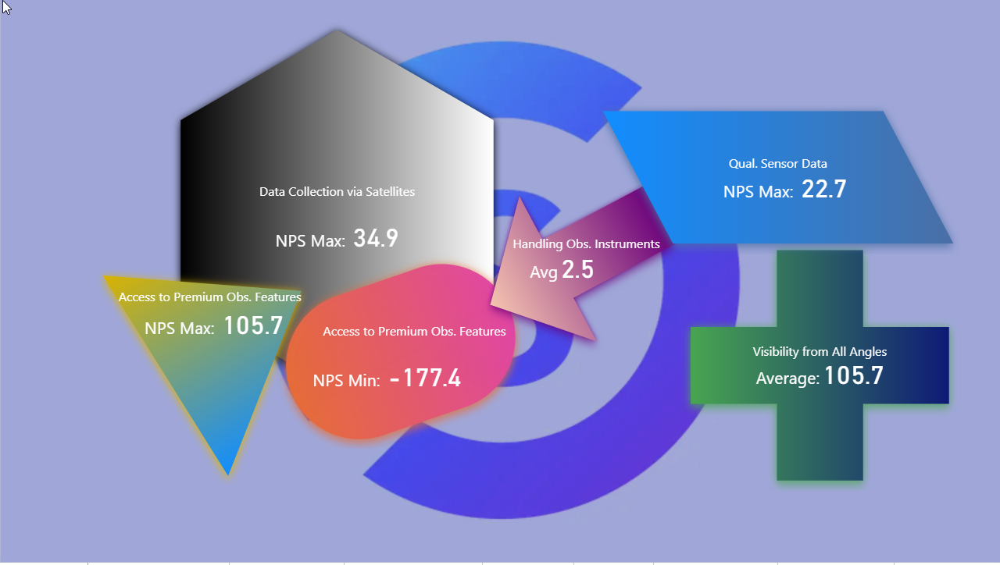

# SDM MetricTile

The **SDM MetricTile** is a custom Power BI visual that displays a single numeric metric inside a richly customizable shape tile. It is designed as a flexible alternative to Power BI's built-in card visual, with full control over shape, color, gradient, effects, typography and positioning.

## Key Features

| Feature | Description |
|---------|-------------|
| **17 shapes** | Rectangle, circle, ellipse, diamond, triangle, pentagon, hexagon, octagon, 5-point star, 6-point star, arrow, chevron, parallelogram, trapezoid, cross, heart, pill |
| **Linear gradients** | Two-color gradients in horizontal, vertical or diagonal directions |
| **Per-corner styling** | Right-angled, rounded, or inward variants on each corner of multi-vertex shapes |
| **Mirror & rotation** | Horizontal/vertical mirror and 0–360° rotation, with live drag handle in edit mode |
| **Effects** | Drop shadow (directional, with size/transparency), glow, edge softening |
| **Drag positioning** | Value, label and logo can be dragged anywhere in edit mode |
| **Data-driven color** | Override the shape color from a measure returning a hex code |
| **Data-driven logo** | Embed a base64 image in the tile from a measure |
| **Conditional formatting** | Most properties (colors, transparency, font sizes, rotation, corner radius) support fx rules |
| **Prefix label** | Optional text prefix in front of the value (currency, units…) |
| **Category label** | Optional descriptive label below or beside the value |
| **Licensing & watermark** | Free / Pro plans, watermark removed with a valid key |

## Editions

| Feature | Free | Pro |
|---------|------|-----|
| All shapes & effects | Yes | Yes |
| Data-driven color & logo | Yes | Yes |
| Drag positioning | Yes | Yes |
| Conditional formatting | Yes | Yes |
| Watermark | Shown | Hidden |
| Support | Community | Email |

## When to use it

The MetricTile is built for **dashboard headline metrics** — KPIs, counters, totals, scorecards — where the visual identity matters and a plain card looks too sterile. Typical scenarios:

- KPI tiles with brand-coloured backgrounds and logos
- Status badges driven by conditional formatting (red/green/amber on threshold)
- Star ratings, arrows, chevrons used for sentiment or direction
- Pills and rounded rectangles in modern dashboard layouts
