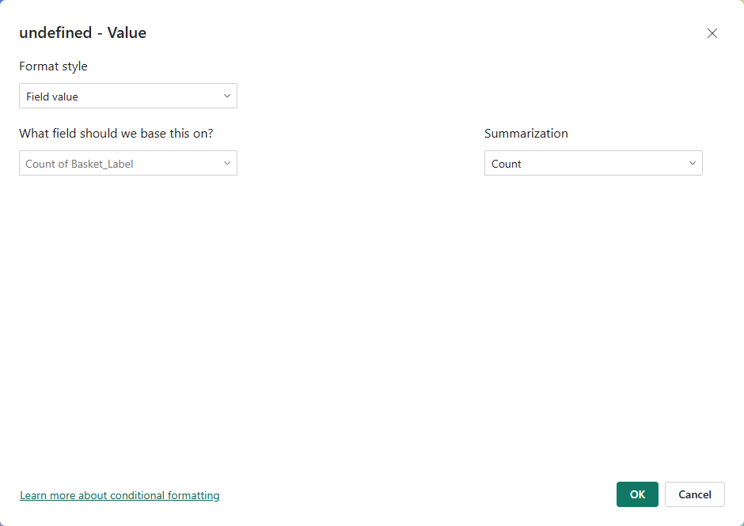

# Conditional font size — DAX recipes

The **Font Size** slice on the **Value**, **Category Label** and **Prefix Label** cards supports **conditional formatting** (the small **fx** button). The size in pixels can therefore be driven by a DAX measure — useful when several MetricTile visuals share a page and you want the most important one to stand out.



## How to bind a measure to font size

1. Open the **Format** pane and expand **Value** (or *Category Label* / *Prefix Label*).
2. Hover over **Font Size** and click the **fx** icon that appears.
3. In the dialog, choose **Format style → Field value** and pick the measure that returns the size in pixels.

> The measure **must return a number in pixels** (integer or float). MetricTile clamps the rendered size to the slider range (`4 px` – `200 px`).

## Why this isn't as simple as it sounds

"Make the font proportional to the value" sounds trivial. In practice the hard part isn't the math — it's defining **what "the values" means**. Proportional *to what*?

A measure plugged into **fx** runs once per tile, with that tile's full filter context. To compute a min/max envelope, the measure has to look at **other** values too — but *which* others? The answer depends on the page architecture, and it changes the formula you write.

Two questions to answer before writing the measure:

1. **What is the "universe"?** Should the min/max envelope respect page slicers (year, region…) or span the entire dataset?
2. **Where does the per-tile category come from?** Is it a row inside a multi-data-point visual (Category role bound), or a filter pinned on the visual itself?

Getting either wrong produces formulas that *look* right but return constant values, zero ranges, or wildly out-of-range font sizes.

### The three filter-removal functions

DAX gives you three ways to "open up" the filter context, with very different scopes:

| Function | Page slicers | Page filters | Visual filters | Effect on the column |
|---|---|---|---|---|
| `ALLSELECTED ( table[col] )` | kept | kept | **kept** | Returns the values *selected at the visual level* — including any filter pinned on the visual |
| `ALL ( table[col] )` | kept | kept | kept | **Surgical**: only filters on this exact column are dropped |
| `ALL ( table )` | removed | removed | removed | Universe-wide reset on the whole table |

**Key insight**: `ALLSELECTED` does **not** mean "ignore everything except page slicers". It means "give me what the user selected at the visual level". A filter pinned via the **Filters on this visual** pane is part of that selection — `ALLSELECTED` preserves it. If your tile has a per-visual filter for *Earth*, `ALLSELECTED ( Planet[Label] )` returns `{ Earth }`, not the full planet list, and your range collapses to zero.

### Picking the right tool

| Page architecture | Right tool | Why |
|---|---|---|
| **One visual, several data points** (Category data role bound, the visual draws several tiles) | `ALLSELECTED ( table[col] )` | Peers come from sibling rows of the same visual |
| **N tiles, one visual each, no per-visual filter** | `ALLSELECTED ( table[col] )` *or* `ALL ( table[col] )` | Both work; `ALL` is more explicit |
| **N tiles, one visual each, per-visual filter** *(common — one tile per brand, region, KPI…)* | `ALL ( table[col] )` | The per-visual filter must be opened up; page slicers (year, region) stay |
| **Universe-wide bounds, ignore everything** | `ALL ( table )` | The envelope is constant across pages and filters |

The recipes below show the two main cases.

## Recipe 1a — Multi-data-point visual (Category role bound)

Use this when your page has **one** MetricTile drawing **several** tiles through the Category data role. `ALLSELECTED` correctly returns the visible peer set:

```dax
Value Font Size (Auto Scale, single visual) =
VAR MinFont   = 8
VAR MaxFont   = 40
VAR CurrValue = [Sales]
VAR Peers =
    CALCULATETABLE (
        VALUES ( 'Product'[Category] ),
        ALLSELECTED ( 'Product'[Category] )
    )
VAR SeriesMin = MINX ( Peers, CALCULATE ( [Sales] ) )
VAR SeriesMax = MAXX ( Peers, CALCULATE ( [Sales] ) )
VAR Range     = SeriesMax - SeriesMin
RETURN
    IF (
        Range = 0,
        ( MinFont + MaxFont ) / 2,
        MinFont + ( CurrValue - SeriesMin ) / Range * ( MaxFont - MinFont )
    )
```

Slicers and page filters narrow the peer set — usually what you want.

## Recipe 1b — N independent tiles with per-visual filters

Each tile is its own MetricTile visual, and you pin a different category on each one through the **Filters on this visual** pane (one tile = Earth, the next = Mars, etc.). This is the most common layout for dashboards.

`ALLSELECTED` would preserve the per-visual filter and the peer set would collapse to a single row, so the range is zero. You need `ALL` on the category column to surgically remove that filter while keeping page slicers and filters intact:

```dax
Value Font Size (Auto Scale, per-tile filter) =
VAR MinFont   = 8
VAR MaxFont   = 40
VAR CurrValue = [Sales]
VAR Peers =
    CALCULATETABLE (
        ADDCOLUMNS (
            VALUES ( 'Product'[Category] ),
            "@v", CALCULATE ( [Sales] )
        ),
        ALL ( 'Product'[Category] )
    )
VAR SeriesMin = MINX ( Peers, [@v] )
VAR SeriesMax = MAXX ( Peers, [@v] )
VAR Range     = SeriesMax - SeriesMin
RETURN
    IF (
        Range = 0,
        ( MinFont + MaxFont ) / 2,
        MinFont + ( CurrValue - SeriesMin ) / Range * ( MaxFont - MinFont )
    )
```

Walking through the runtime for the *Earth* tile, on a page slicered to *year = 2025*:

- `CurrValue` = Earth's sales in 2025 (per-tile filter applies to this measure call)
- `Peers` = every category's sales in 2025 (year preserved, category filter dropped)
- `SeriesMin` / `SeriesMax` = bounds across the full category set in 2025

Slicers and page filters still narrow the universe — only the per-tile category is opened up.

**To ignore page slicers as well** (constant envelope across the whole dataset), replace `ALL ( 'Product'[Category] )` with `ALL ( 'Product' )`.

## Recipe 2 — Fixed scale (known value range)

You know in advance that your value lives between `1` and `100` (e.g. a survey score, a percentage, a rating). You want **1 → 10 px** and **100 → 60 px**.

This is just a linear interpolation — no `ALLSELECTED` / `ALL` needed because the bounds are constants:

```dax
Value Font Size (Fixed 1-100) =
VAR ValueMin = 1
VAR ValueMax = 100
VAR FontMin  = 10
VAR FontMax  = 60
VAR Curr     = [Score]
RETURN
    FontMin + ( Curr - ValueMin ) / ( ValueMax - ValueMin ) * ( FontMax - FontMin )
```

**Reading the formula**:

- `(Curr - ValueMin) / (ValueMax - ValueMin)` → normalized position in `[0, 1]`
- `* (FontMax - FontMin)` → re-scaled to the target px range
- `+ FontMin` → shifted so that `Curr = ValueMin` yields `FontMin`

If the value can fall outside the expected range, clamp it before scaling:

```dax
VAR ClampedCurr = MIN ( MAX ( Curr, ValueMin ), ValueMax )
```

## Recipe 3 — Logarithmic scale (large-spread values)

When values span several orders of magnitude (e.g. `100`, `2 500`, `120 000`), a linear scale crushes the small ones. A log scale gives a more legible result. The pattern below uses Recipe 1b's surgical `ALL` — adapt to `ALLSELECTED` if you're in the multi-data-point case (Recipe 1a):

```dax
Value Font Size (Log Scale) =
VAR MinFont   = 10
VAR MaxFont   = 50
VAR CurrValue = [Sales]
VAR Peers =
    CALCULATETABLE (
        ADDCOLUMNS (
            VALUES ( 'Product'[Category] ),
            "@v", CALCULATE ( [Sales] )
        ),
        ALL ( 'Product'[Category] )
    )
VAR LogMin = LN ( MAX ( MINX ( Peers, [@v] ), 1 ) )
VAR LogMax = LN ( MAX ( MAXX ( Peers, [@v] ), 1 ) )
VAR LogCur = LN ( MAX ( CurrValue, 1 ) )
VAR Range  = LogMax - LogMin
RETURN
    IF (
        Range = 0,
        ( MinFont + MaxFont ) / 2,
        MinFont + ( LogCur - LogMin ) / Range * ( MaxFont - MinFont )
    )
```

`MAX ( …, 1 )` guards against `LN(0)`. Use a different floor (e.g. `0.01`) if your values are smaller than 1.

## Debugging tips

When the rendered font size doesn't match expectations, the problem is almost always **filter context**, not arithmetic. Drop a Table visual on the page with the same category as your tiles, and add three diagnostic measures to inspect what the formula sees:

```dax
Debug_Curr = [Sales]
Debug_Min  = MINX ( <Peers expression>, CALCULATE ( [Sales] ) )
Debug_Max  = MAXX ( <Peers expression>, CALCULATE ( [Sales] ) )
```

Read the table:

- `Min = Max = Curr` on a single row → the peer set has collapsed to one element. Your filter-removal function isn't dropping what you think it is (typical sign that `ALLSELECTED` is preserving a per-visual filter — switch to `ALL`).
- `Min` and `Max` look correct but the *current row's* `Curr` doesn't fall between them → the per-tile filter isn't aligned with your category column.
- The range looks much wider than expected → you've probably used `ALL ( table )` instead of `ALL ( table[col] )` and dropped the page slicers too.

## General tips

- **Keep the px range comfortable**: `8 px` is the practical minimum for legibility; above `60 px` you may run out of room in narrow tiles. The visual still clamps to `4–200 px` to avoid degenerate sizes.
- **Combine with Display Units**: dynamic font size pairs naturally with **Auto** display units — the smallest tiles will round to `K`/`M`, the largest will show full digits.
- **Apply the same recipe to Category Label and Prefix Label** if you want the whole text block to scale — bind the same measure (or a derivative) to each card's **Font Size** fx slot.
