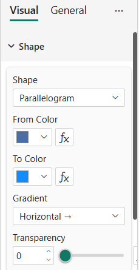

# Shape

The **Shape** card controls the geometric form of the tile, its fill color and an optional gradient.



## Properties

| Property | Description | Default |
|----------|-------------|---------|
| **Shape** | Geometry of the tile (17 options — see below) | Rectangle |
| **Trapezoid Angle** | Slope angle (°) — only when Shape is *Trapezoid* | 75 |
| **From Color** | Primary fill color. Supports conditional formatting (fx). | #4A6FA5 |
| **To Color** | Second color of the gradient. Supports conditional formatting (fx). | #4A6FA5 |
| **Gradient** | Direction of the linear gradient: None, Horizontal →, Vertical ↓, Diagonal ↘, Diagonal ↗ | None |
| **Transparency** | Fill opacity (0–100%). Supports conditional formatting (fx). | 0 |

## Available shapes

| Shape | Notes |
|-------|-------|
| **Rectangle** | 4 corners — supports per-corner styling |
| **Circle** | Inscribed circle (no corners) |
| **Ellipse** | Elliptical fit to the container |
| **Diamond** | 4 corners — supports per-corner styling |
| **Triangle** | 3 corners — supports per-corner styling |
| **Pentagon** | Convex angles (inscribed circle fit) |
| **Hexagon** | Convex angles (inscribed circle fit) |
| **Octagon** | Convex angles (inscribed circle fit) |
| **Star (5)** | Convex + reflex angles |
| **Star (6)** | Convex + reflex angles |
| **Arrow** | Convex + reflex angles — use Mirror H/V + Rotation for direction |
| **Chevron** | Convex + reflex angles — use Mirror H/V + Rotation for direction |
| **Parallelogram** | 4 corners |
| **Trapezoid** | 4 corners + Trapezoid Angle slider |
| **Cross** | Convex + reflex angles |
| **Heart** | No corners (curved path) |
| **Pill** | No corners (rounded ends) |

:::info Single-direction shapes
Triangle, arrow and chevron come in a single canonical orientation. To get other variants (down-arrow, left-chevron, etc.) combine **Mirror Horizontal**, **Mirror Vertical** and **Rotation** from the [Transform](./transform) card.
:::

## Gradient

Pick two colors in **From Color** and **To Color**, then set **Gradient** to a direction other than *None*. The gradient is rendered as an SVG `<linearGradient>` filling the entire shape.

:::warning Series Color overrides gradient
When the **Series Color** data role is bound to a measure, the gradient is automatically forced to *None* and both colors are overridden by the data value. See [Data Roles](../getting-started/data-roles#series-color).
:::

## Transparency & conditional formatting

Transparency, From Color and To Color all expose the **fx** button. Use it to drive these properties from a measure or rule based on your data:

```dax
TileColor = SWITCH(
    TRUE(),
    [KPI] >= [Target],            "#2E8B57",
    [KPI] >= 0.8 * [Target],      "#DAA520",
                                  "#B22222"
)
```
