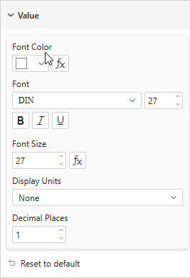

# Value

The **Value** card controls the formatting of the main numeric value displayed in the tile.

## Properties

| Property | Description | Default |
|----------|-------------|---------|
| **Font Color** | Color of the value text. Supports conditional formatting (fx). | #FFFFFF |
| **Font** | Font family, size, bold, italic, underline (FontControl) | DIN, 27 px |
| **Display Units** | Auto, None, k (thousands), M (millions), Mds (billions), … | Auto |
| **Decimal Places** | Number of decimal digits (0–10) | 0 |

## Font Control

The **Font** property is a Power BI **FontControl** — a unified control that bundles family, size and the bold/italic/underline toggles into a single panel. The size supports **conditional formatting (fx)** so you can shrink or grow the value based on a measure.

## Display Units & Decimals

The **Display Units** dropdown follows the standard Power BI display-unit list:

- **Auto** — let Power BI choose based on the value magnitude
- **None** — raw value with the measure's format string
- **Thousands (k)**, **Millions (M)**, **Billions (Mds)**, **Trillions** — explicit scale

The visual respects the **format string** of the bound measure (currency symbol, percentage, locale-specific decimal/grouping separators). The **Decimal Places** override applies after display-unit scaling.

## Centering

The value is centered horizontally and vertically by default, using a **scan-line intersection algorithm**: the renderer projects horizontal scan lines through the inscribed bounding box of the (possibly rotated) shape and picks the largest unobstructed band, ensuring the text never overflows the silhouette — even for diamond, triangle, star, heart and other non-rectangular shapes.

To override the automatic centering, use the [Layout](./layout) card with **Custom positioning** on, or simply **drag** the value text in edit mode.
